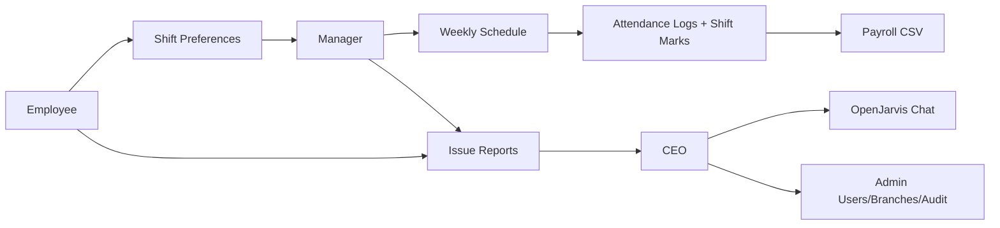
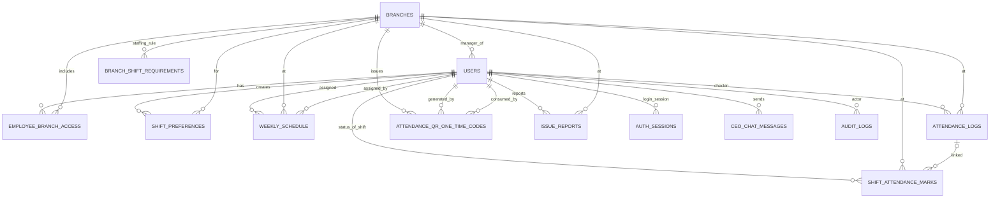

# Workforce Manager (Web + Mobile Browser)

He thong quan ly nhan cong da chi nhanh: dang ky ca, phan lich, cham cong, bao cao su co, quan tri nhan su, va theo doi tong quan cho CEO.

## 1) Nhanh trong 1 phut

- Chay nhanh:

```bash
python quickstart.py
```

- Mo: `http://127.0.0.1:5000`
- Tai khoan mac dinh:
	- Username: `ceo`
	- Password: `123456`

## 2) He thong lam gi

- Employee:
	- Chon chi nhanh duoc phep.
	- Dang ky ca lam theo tuan.
	- Cham cong check-in/check-out.
	- Bao cao su co.
- Manager:
	- Quan ly nhan vien trong chi nhanh minh.
	- Xem dang ky ca, phan lich tuan.
	- Cap QR cham cong va override trang thai di lam.
	- Xuat CSV cong gio.
- CEO:
	- Xem tong quan nhieu chi nhanh.
	- Quan tri user/branch.
	- Xem audit log.
	- Chat voi OpenJarvis de nhan canh bao bat thuong.

## 3) Luong van hanh (de hieu)



## 4) 4 ca co dinh

- S1: 07:00-11:00
- S2: 11:00-15:00
- S3: 15:00-19:00
- S4: 19:00-22:00

## 5) Mo hinh database

Backend tu dong chon DB:
- Co `DATABASE_URL` -> Postgres.
- Khong co -> SQLite (`data.db`, hoac `/tmp/data.db` tren Vercel).

### ERD tom tat



### Bang du lieu chinh (it chu, de nho)

| Bang | Muc dich |
|---|---|
| `users` | Tai khoan, role, thong tin nhan su |
| `branches` | Chi nhanh |
| `employee_branch_access` | Employee duoc phep vao chi nhanh nao |
| `shift_preferences` | Dang ky ca theo tuan |
| `weekly_schedule` | Lich duoc manager phan |
| `attendance_logs` | Check-in/check-out thuc te |
| `attendance_qr_one_time_codes` | Ma one-time khi quet QR |
| `shift_attendance_marks` | Ket qua di lam/vang cho tung ca |
| `issue_reports` | Su co do employee/manager gui |
| `auth_sessions` | Session token (khi dung DB session) |
| `ceo_chat_messages` | Lich su chat CEO |
| `audit_logs` | Nhat ky thao tac quan tri |
| `branch_shift_requirements` | Min/max nhan su moi ca |

## 6) Quy tac cham cong QR one-time

- Manager tao QR tĩnh theo chi nhanh.
- Employee quet QR -> he thong cap `random_key` one-time (TTL ngan).
- Employee check-in bang `qr_token + one_time_code`.
- Qua 15 phut sau gio bat dau ca -> auto danh `absent`, tu choi check-in.
- Manager co quyen override sang `present_override` khi can.

## 7) API theo nhom

- Auth/Profile: `/api/login`, `/api/logout`, `/api/profile/me`, `/api/current-user`.
- Employee: `/api/employee/branches`, `/api/employee/preferences`, `/api/employee/assigned-schedule`.
- Attendance: `/api/attendance/check-in`, `/api/attendance/check-out`, `/api/attendance/check-in-qr-one-time`, `/api/attendance/my-week`.
- Manager: `/api/manager/schedule`, `/api/manager/preferences`, `/api/manager/employees`, `/api/manager/issues`, `/api/manager/payroll-export.csv`.
- CEO/Admin: `/api/ceo/chat`, `/api/ceo/issues`, `/api/admin/users`, `/api/admin/branches`, `/api/admin/branch-audit-logs`.

## 8) Cau truc code (sau khi tach)

- `backend/app.py`: bootstrap app + helper dung chung.
- `backend/routes/general_routes.py`: auth, profile, meta.
- `backend/routes/attendance_routes.py`: check-in/out, QR.
- `backend/routes/operations_routes.py`: issue, preference, schedule, manager HR.
- `backend/routes/leadership_routes.py`: CEO chat/issues + admin users/branches/audit.
- `backend/db.py`: schema + khoi tao DB + adapter SQLite/Postgres.
- `frontend/js/app.js`: SPA logic phia client.

## 9) Chay local (day du)

```bash
python -m venv .venv
.venv\Scripts\activate
pip install -r requirements.txt
python start.py
```

Reset DB:

```bash
python reset_database.py --yes
```

## 10) Deploy Vercel + production note

- Entrypoint serverless: `api/index.py`.
- Rewrite route: `vercel.json`.
- KHUYEN NGHI production:
	- Dung Vercel Postgres (hoac Postgres bat ky) va set `DATABASE_URL`.
	- Set secret manh:
		- `SESSION_TOKEN_SECRET` (>=32 ky tu)
		- `ATTENDANCE_QR_SECRET` (>=32 ky tu)

Neu dung SQLite tren Vercel: du lieu o `/tmp`, khong ben vung giua cold start/redeploy.
Vi vay khong the luu DB lau dai tren Vercel bang file SQLite.

## 11) Bien moi truong quan trong

- DB: `DATABASE_URL`, `POSTGRES_URL`, `POSTGRES_PRISMA_URL`, `POSTGRES_URL_NON_POOLING`, `SQLITE_PATH`.
- Session/security: `STATELESS_SESSION`, `SESSION_TOKEN_SECRET`, `ATTENDANCE_QR_SECRET`, `FLASK_DEBUG`.
- OpenJarvis: `OPENJARVIS_ENABLED`, `OPENJARVIS_API_URL`, `OPENJARVIS_MODEL`, `OPENJARVIS_TIMEOUT_SECONDS`, `OPENJARVIS_TEMPERATURE`, `OPENJARVIS_MAX_TOKENS`.

## 12) Ghi chu nhanh cho team

- Local/dev: SQLite la du.
- Staging/prod: dung Postgres de session revocable va du lieu ben vung.
- Truoc khi release: test login, schedule, attendance QR, payroll export, admin CRUD.
